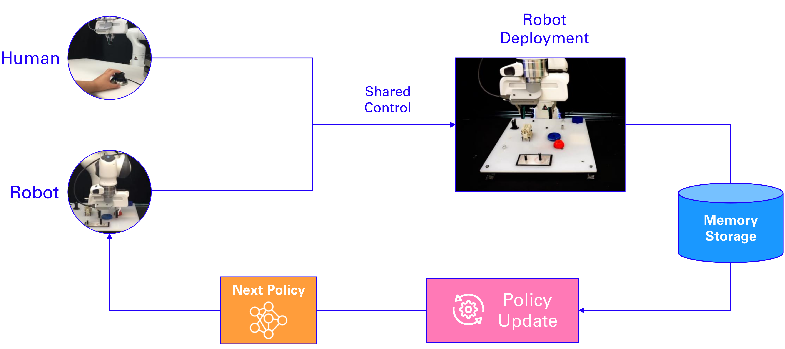

# Sirius 🌟: Robot Learning on the Job

<br>

This is the official codebase for the [**Sirius**](https://ut-austin-rpl.github.io/sirius/) paper:

**Robot Learning on the Job: Human-in-the-Loop Autonomy and Learning During Deployment**
<br> [Huihan Liu](https://huihanl.github.io/), [Soroush Nasiriany](http://snasiriany.me/), [Lance Zhang](https://github.com/Lantian-Lance-Zhang), [Zhiyao Bao](https://www.linkedin.com/in/zhiyao-bao/), [Yuke Zhu](https://www.cs.utexas.edu/~yukez/) 
<br> [UT Austin Robot Perception and Learning Lab](https://rpl.cs.utexas.edu/)
<br> Robotics: Science and Systems (RSS), 2023
<br> **[[Paper]](https://arxiv.org/abs/2211.08416)** &nbsp;**[[Project Website]](https://ut-austin-rpl.github.io/sirius/)** &nbsp;**[[Real Robot Control]](https://ut-austin-rpl.github.io/deoxys-docs/html/getting_started/overview.html)** 

<a href="https://ut-austin-rpl.github.io/sirius/" target="_blank"></a>

<br>

## Quickstart

Sirius builds upon [robomimic](https://github.com/ARISE-Initiative/robomimic), a framework for robot learning from demonstration. Sirius also uses the robotics simulator [robosuite](https://github.com/ARISE-Initiative/robosuite) powered by the MuJoCo physics engine.

### Setup Sirius codebase

#### Installing Sirius

```
git clone https://github.com/UT-Austin-RPL/sirius
cd sirius
conda env create -f sirius.yml
conda activate sirius
pip install -e .
```

#### Installing ```robosuite```

The additional reference for installing robosuite [here](https://robomimic.github.io/docs/introduction/installation.html) and [here](https://robosuite.ai/docs/installation.html#install-from-source) could be helpful.

```
$ git clone https://github.com/ARISE-Initiative/robosuite.git
$ cd robosuite
$ pip install -r requirements.txt
$ pip install -e .
```

## Usage

### Running Sirius


Running Sirius intervention-guided policy learning:

```
python robomimic/scripts/train.py --config robomimic/exps/sirius/sirius.json
```

IWR baseline:

```
python robomimic/scripts/train.py --config robomimic/exps/sirius/bc_iwr.json
```

BC baseline:

```
python robomimic/scripts/train.py --config robomimic/exps/sirius/bc.json
```

<br>

### Sirius Data Collection Pipeline 

We include the script for collecting demonstrations and performing human intervention during robot policy execution below. We use a spacemouse for providing both demonstration and intervention. More details for setting up Spacemouse can be found [here](https://ut-austin-rpl.github.io/deoxys-docs/html/tutorials/using_teleoperation_devices.html).

#### Performing Human Demonstration

Perform human demonstration with the flag ```--all-demos```:

```
python robomimic/scripts/hitl/collect_hitl_demos.py --all-demos --num-traj 50
```

#### Policy Execution with Intervention

Perform human intervention with the policy checkpoint ```${checkpoint}```:

```
python robomimic/scripts/hitl/collect_hitl_demos.py --num-traj 50 --checkpoint ${checkpoint}
```

<br>

### Processing data

#### Adding modalities

By default, the datasets are generated in the minimum format with only low-level state information to save space. To add image observation and other modalities for training, run the following post-processing script. It will process the original data ```${data.hdf5}``` into ```${data_processed.hdf5}```, with image size ```${image_size}```. By default, the two camera view uses are agentview and robot0_eye_in_hand, which you can modify in the script ```template_process_sim_dataset.sh```.

```
cd robomimic/scripts/hitl

source template_process_sim_dataset.sh ${data.hdf5} ${data_processed.hdf5} ${image_size}
```

<br>

## Citation
```bibtex
@inproceedings{liu2022robot,
    title = {Robot Learning on the Job: Human-in-the-Loop Autonomy and Learning During Deployment},
    author = {Huihan Liu and Soroush Nasiriany and Lance Zhang and Zhiyao Bao and Yuke Zhu},
    booktitle = {Robotics: Science and Systems (RSS)},
    year = {2023}
}
```